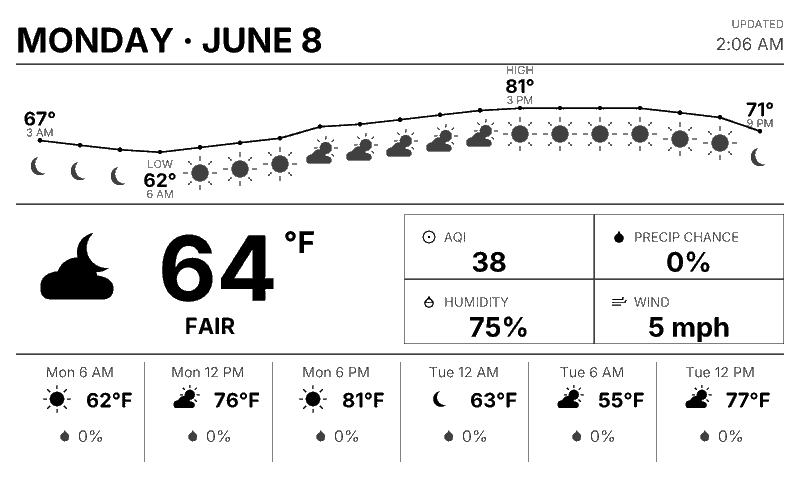

# trmnl-nws-weather

A Python service that renders a weather display PNG for an OG 7.5" TRMNL e-ink
panel (800 × 480, 2-bit / 4 grey levels). It periodically fetches the National
Weather Service digital DWML forecast, parses it, and writes a high-quality
timestamped image.

*Strongly* inspired by the layout of [Today: Beautiful Weather](https://trmnl.com/recipes/270447)
with changes such as:

- Utilizes the National Weather Service weather data (and therefore US-only, at the moment)
- A larger day / date in the header
- A forecast graph which always shows the start/end time and temperature, as well as the low/high
- Forecasted weather conditions are displayed below the graph
- Forcast graph always has current time's next hour as first value, as a full 18 hours of data is shown
- AQI (Air Quality Index) display
- The forecast details are shown for 6 hour intervals, allowing a 2 day glanceable summary



## Layout

- **Header** - large date on the left (the static location line is removed to
  free space); a small, de-emphasised "Updated" time on the right.
- **Temperature graph** - the forecast temperature curve with HIGH / LOW
  markers (value + time) and a small weather condition icon below each
  hour's dot.
- **Current conditions** - sourced from the latest observed conditions at
  the nearest station (falling back to the current forecast hour if the
  observation is unavailable). Left: large weather icon, temperature, and a
  condition label; right: a 2 × 2 box grid showing AQI, Precipitation Chance (forecast
  POP), observed Humidity, and observed Wind.
- **Forecast strip** - Six 6-hourly forecast points starting from the next 6-hour boundary: time, icon + temperature, and
  precipitation chance. The chance is prefixed with the specific type when the
  feed gives one (T'Storm / Rain / Snow / Sleet / Ice - thunderstorms are kept
  distinct from rain); when no type is specified, a droplet icon is shown
  instead of a word.

A rain or thunderstorm with a precipitation chance below 40% is presented as
cloudy (icon and text) everywhere it appears - current conditions, the
forecast strip, and the graph - since it probably won't precipitate. Snow,
sleet, and ice are always shown as-is.

Both unit systems (Imperial °F / mph, Metric °C / km/h) and light and dark modes are supported.

### Rendering quality

Everything is drawn on an 8-bit grayscale canvas at 4× the target resolution
and downscaled with LANCZOS resampling before being quantised to four grey
levels. This antialiases text, the temperature curve, and the procedurally
drawn icons so they stay crisp on the panel. The font (the freely-licensed
**Inter** family, chosen to match the TRMNL reference design; DejaVu Sans is
also bundled) is in `trmnl_nws_weather/assets/fonts/` so rendering does not
depend on host system fonts.

## Requirements

- Python 3.10+
- [uv](https://docs.astral.sh/uv/) or `pip` (both are documented below)
- Dependencies: `Pillow`, `defusedxml`, `python-dotenv`

The freely-licensed fonts are vendored in the package, so no system fonts are
required and the only network access needed is outbound HTTPS to
`forecast.weather.gov` (and, for AQI, `air-quality-api.open-meteo.com` or
user-provided AQI data source).

## Install

The project works using uv (prefered) or python/pip. Everywhere below you
can swap `uv run trmnl-nws-weather ...` for `python -m trmnl_nws_weather ...`.

```bash
# Option A - uv (creates .venv and installs dependencies):
uv sync

# Option B - pip / plain Python:
python -m venv .venv
source .venv/bin/activate        # Windows: .venv\Scripts\Activate.ps1
pip install -r requirements.txt  # or: pip install .  (also installs the CLI)
```

## Quick start - send to TRMNL (most common)

The simplest way to get weather onto a panel is TRMNL's
**[Webhook Image](https://help.trmnl.com/en/articles/13213669-webhook-image)**
plugin: this tool renders the PNG and POSTs it straight to your device.

1. In TRMNL, go to **Plugins → Webhook Image → Add to my plugins**, name the
   instance, and copy the private **webhook URL** it gives you (treat it like a
   password).
2. (Optional) Configure the .env environment variables file (see [.env.example](.env.example) for options)
3. Set your location and render + upload in one command:

```bash
# Render the current weather and POST it to your TRMNL webhook URL:
uv run trmnl-nws-weather \
  --lat 40.0404 --lon -76.3042 \
  --webhook "https://usetrmnl.com/api/plugin_settings/<your-uuid>/image"
```

If you have configured the latitude/longitude in the environment/.env file, you do not need to specify them
on the command line.

```bash
uv run trmnl-nws-weather --webhook "https://usetrmnl.com/api/plugin_settings/<your-uuid>/image"
```

The output is a 2 bit, 800×480 PNG - well under TRMNL's 5 MB limit.
To keep the panel current, run that command on a schedule (cron,
Task Scheduler, systemd timer) - every 30 minutes is a good default. See the
[Runbook](docs/RUNBOOK.md) for a scheduling and caching details.

## Other ways to run it

```bash
# Render once from the live NWS feed (writes a PNG, prints JSON):
uv run trmnl-nws-weather --once

# Run the periodic service (re-renders every TRMNL_REFRESH_SECONDS):
uv run trmnl-nws-weather

# Serve the latest image over HTTP (default port 8400; --port to change):
uv run trmnl-nws-weather --webserver --port 8080
```

> For step-by-step operational instructions (setup, generating a PNG, running
> the service, configuration, troubleshooting), see the
> [Runbook](docs/RUNBOOK.md).

Images are written to `images/img_<lat>_<lon>_<unix-ts>.png` (e.g.
`img_40.0404_-76.3042_1780590454.png`). A one-shot run prints a JSON result to
stdout (logs go to stderr):

```json
{"filename": "img_40.0404_-76.3042_1780590454.png", "cached": false, "description": "Intercourse PA"}
```

### Caching

A one-shot request is served from cache when an image for the same
coordinates was generated within the last 15 minutes
(`TRMNL_CACHE_SECONDS`): the existing filename is returned with `"cached":
true` and no fetch/render happens. Pass `--no-cache` to always render. Offline
(`--xml`) renders bypass the cache. The location description is embedded in the
PNG metadata so cache hits can report it without re-fetching.

### CLI options

| Flag | Description |
| --- | --- |
| `--once` | Render a single image and exit |
| `--xml PATH` | Load forecast XML from a file instead of the network |
| `--obs PATH` | Load observation JSON from a file (pairs with `--xml`) |
| `--lat DEG` | Override latitude, decimal -90..90 (requires `--lon`; truncated to 4 digits) |
| `--lon DEG` | Override longitude, decimal -180..180 (requires `--lat`; truncated to 4 digits) |
| `--units {imperial,metric}` | Override the unit system |
| `--theme {light,dark}` | Override the polarity |
| `--time-format {12,24}` | Override the clock format |
| `--output-dir PATH` | Override the images directory |
| `--no-cache` | Always render, ignoring any recent cached image |
| `--webhook URL` | Render, then POST the image to a TRMNL webhook URL, and exit |
| `--webserver` | Serve the latest image over HTTP at `/weather` |
| `--port INT` | Port for `--webserver` (default: 8400) |
| `-v`, `--verbose` | Debug logging |

## Configuration

Settings come from environment variables (each prefixed `TRMNL_`), with defaults
for the built-in Intercourse, PA point so the tool runs out of the box. The
easiest way to set them is a `.env` file in the project root - copy the
documented [`.env.example`](.env.example) (configured for a second city, Boring,
Oregon) to `.env` and edit it. CLI flags override env vars, which override the
defaults.

| Variable | Default | Meaning |
| --- | --- | --- |
| `TRMNL_LATITUDE` | `40.0404` | Forecast point latitude |
| `TRMNL_LONGITUDE` | `-76.3042` | Forecast point longitude |
| `TRMNL_UNITS` | `imperial` | `imperial` or `metric` |
| `TRMNL_THEME` | `light` | `light` or `dark` |
| `TRMNL_TIME_FORMAT` | `12` | `12` or `24` hour clock |
| `TRMNL_REFRESH_SECONDS` | `1800` | Re-render interval |
| `TRMNL_GRAPH_WINDOW_HOURS` | `18` | Temperature graph time span |
| `TRMNL_GRAPH_NOW_POSITION` | `0.0` | "Now" position in the graph (0 = left) |
| `TRMNL_FORECAST_HOURS` | `6` | Columns in the forecast strip |
| `TRMNL_CACHE_SECONDS` | `900` | Cache window for same-coordinate requests |
| `TRMNL_CLEANUP_AGE_SECONDS` | `21600` | Delete generated PNGs older than this |
| `TRMNL_OUTPUT_DIR` | `images` | Output directory |
| `TRMNL_AQI_PROVIDER` | `open-meteo` | AQI source: `open-meteo` or `none` |
| `TRMNL_AQI_URL` | *(empty)* | Custom AQI endpoint; overrides the provider |

### Air Quality Index (AQI)

The NWS feed carries no air-quality data, so the AQI box is filled from a
separate source:

- **`open-meteo`** (default) - the free, no-API-key
  [Open-Meteo Air Quality API](https://open-meteo.com/en/docs/air-quality-api).
  It returns the US EPA AQI for your configured latitude/longitude, so it just
  works for anyone.
- **`none`** - disables the lookup; the AQI box shows `--`.
- **Custom endpoint** - set `TRMNL_AQI_URL` to any URL that returns JSON shaped
  like `{"aqi": 42}` (for example, a local air-quality sensor). When set, it
  takes precedence over `TRMNL_AQI_PROVIDER`.

## Data source

National Weather Service MapClick, two endpoints for the same point (US and
territories only - the NWS does not cover locations outside its area):

```text
# Hourly forecast (drives the graph and forecast strip):
https://forecast.weather.gov/MapClick.php?lat=<lat>&lon=<lon>&FcstType=digitalDWML

# Current observations + worded forecast (drives current conditions + header):
https://forecast.weather.gov/MapClick.php?lat=<lat>&lon=<lon>&FcstType=json
```

The JSON `currentobservation` block supplies the latest measured temperature,
humidity, wind, and condition; `data.weather[1]` supplies the upcoming-period
headline. AQI (the one value NWS does not provide) comes from Open-Meteo by
default - see [Air Quality Index](#air-quality-index-aqi). Sample NWS responses
are committed at `docs/MapClick.php.xml` and `docs/MapClick.json` for offline
use:

```bash
uv run trmnl-nws-weather --once --xml docs/MapClick.php.xml --obs docs/MapClick.json
```

## Development

```bash
# uv:
uv run python -m pytest
# pip (with the venv activated and pytest installed: pip install pytest):
python -m pytest
```

## Project layout

```text
trmnl_nws_weather/
  __init__.py      # package initialization
  __main__.py      # CLI entry point
  aqi.py           # optional AQI lookup (Open-Meteo / custom URL)
  config.py        # settings (env-driven)
  icons.py         # procedurally drawn weather glyphs
  models.py        # forecast data models + Sky classification
  nws.py           # fetch + parse digital DWML
  render.py        # 2-bit 800x480 page renderer
  service.py       # fetch -> render -> timestamped PNG loop
  theme.py         # palette + vendored fonts
  units.py         # Imperial/Metric conversion + formatting
  utils.py         # utility functions
assets/
  fonts/           # fonts (Inter, DejaVu Sans)
```
